# Modelo de datos (ERD)

Modelo objetivo del sistema. El schema de Prisma incorpora las entidades de forma incremental, milestone a milestone: hoy están implementadas `Organization`, `Branch`, `User`, `UserRole`, `UserBranch`, `Session`, `ProfessionalProfile` y `AuditLog`.

```mermaid
erDiagram
  Organization ||--o{ Branch : "tiene"
  Organization ||--o{ User : "tiene"
  Organization ||--o{ Patient : "tiene"
  Organization ||--o{ Practice : "define"
  Organization ||--o{ CoverageProvider : "registra"

  User ||--o{ UserRole : "tiene"
  User ||--o{ UserBranch : "opera en"
  Branch ||--o{ UserBranch : "habilita"
  User ||--o{ Session : "abre"
  User ||--o| ProfessionalProfile : "puede ser"
  ProfessionalProfile ||--o{ AvailabilityRule : "define"
  Branch ||--o{ AvailabilityRule : "en"
  ProfessionalProfile ||--o{ AvailabilityException : "tiene"

  Patient ||--o{ PatientClinicalProfile : "versiones"
  Patient ||--o{ PatientCoverage : "tiene"
  CoveragePlan ||--o{ PatientCoverage : "cubre"
  CoverageProvider ||--o{ CoveragePlan : "ofrece"
  CoverageProvider ||--o{ FeeSchedule : "convenio"
  CoveragePlan |o--o{ FeeSchedule : "aplica a"
  FeeSchedule ||--o{ FeeScheduleItem : "contiene"
  Practice ||--o{ FeeScheduleItem : "se arancela"

  Patient ||--o{ Appointment : "tiene"
  ProfessionalProfile ||--o{ Appointment : "atiende"
  Branch ||--o{ Appointment : "ocurre en"
  Practice |o--o{ Appointment : "sugiere"
  Appointment ||--o{ NotificationOutbox : "genera"
  Patient ||--o{ NotificationOutbox : "destinatario"

  Patient ||--o{ ClinicalEntry : "tiene"
  ProfessionalProfile ||--o{ ClinicalEntry : "firma"
  Appointment |o--o{ ClinicalEntry : "origina"
  ClinicalEntry |o--o{ ClinicalEntry : "corrige"
  Patient ||--o{ ClinicalFile : "tiene"
  ClinicalEntry |o--o{ ClinicalFile : "adjunta"
  User ||--o{ ClinicalFile : "sube"

  Patient ||--o{ ToothEvent : "registra"
  PerformedService |o--o{ ToothEvent : "origina"
  Patient ||--o{ TreatmentPlan : "tiene"
  TreatmentPlan ||--o{ TreatmentItem : "contiene"
  Practice ||--o{ TreatmentItem : "usa"
  TreatmentItem |o--o{ PerformedService : "se ejecuta en"

  Patient ||--o{ PerformedService : "recibe"
  ProfessionalProfile ||--o{ PerformedService : "realiza"
  Practice ||--o{ PerformedService : "es de"
  Appointment |o--o{ PerformedService : "durante"
  PatientCoverage |o--o{ PerformedService : "factura a"

  Patient ||--o{ Payment : "paga"
  User ||--o{ Payment : "recibe"
  Payment ||--o{ PaymentAllocation : "se imputa"
  PerformedService ||--o{ PaymentAllocation : "recibe imputacion"

  CoverageProvider ||--o{ Liquidation : "se liquida a"
  Liquidation ||--o{ LiquidationItem : "contiene"
  PerformedService ||--o{ LiquidationItem : "se reclama en"

  User |o--o{ AuditLog : "actor"
  Branch |o--o{ AuditLog : "contexto"
  User |o--o{ BackupRecord : "dispara"

  Organization { uuid id PK
    string name
    string timezone
    bool active }
  Branch { uuid id PK
    uuid organizationId FK
    string name
    string address
    bool active }
  User { uuid id PK
    uuid organizationId FK
    string username UK
    string displayName
    string passwordHash
    bool active
    bool mustChangePassword
    bool onboardingCompleted }
  UserRole { uuid userId FK
    enum role "ADMIN DENTIST RECEPTIONIST" }
  UserBranch { uuid userId FK
    uuid branchId FK }
  Session { uuid id PK
    string tokenHash UK "sha256 del token de la cookie"
    uuid userId FK
    string csrfToken
    timestamptz lastSeenAt
    timestamptz expiresAt
    timestamptz revokedAt }
  ProfessionalProfile { uuid id PK
    uuid userId FK,UK
    string licenseNumber
    string specialty
    bool active }
  AvailabilityRule { uuid id PK
    uuid professionalId FK
    uuid branchId FK
    int weekday
    int startMinute
    int endMinute }
  AvailabilityException { uuid id PK
    uuid professionalId FK
    uuid branchId FK "nullable"
    enum type "BLOCK VACATION ABSENCE EXTRA"
    timestamptz startsAt
    timestamptz endsAt }
  Patient { uuid id PK
    uuid organizationId FK
    string firstName
    string lastName
    string documentType
    string documentNumber "unico por organizacion, nullable"
    date birthDate
    string phone
    timestamptz archivedAt }
  PatientClinicalProfile { uuid id PK
    uuid patientId FK
    text allergies
    text medication
    text history
    text alerts
    uuid recordedBy FK
    timestamptz createdAt }
  CoverageProvider { uuid id PK
    string name
    enum kind "OBRA_SOCIAL PREPAGA" }
  CoveragePlan { uuid id PK
    uuid providerId FK
    string name
    string code }
  PatientCoverage { uuid id PK
    uuid patientId FK
    uuid planId FK
    string affiliateNumber
    date validFrom
    date validTo
    bool isPrimary }
  Practice { uuid id PK
    string code UK
    string name
    int defaultDurationMinutes
    decimal basePrice }
  FeeSchedule { uuid id PK
    uuid providerId FK
    uuid planId FK "nullable"
    date validFrom
    date validTo }
  FeeScheduleItem { uuid id PK
    uuid feeScheduleId FK
    uuid practiceId FK
    string nomenclatorCode
    decimal insurerAmount
    decimal patientCopay }
  Appointment { uuid id PK
    uuid branchId FK
    uuid patientId FK
    uuid professionalId FK
    uuid practiceId FK "nullable"
    timestamptz startsAt
    timestamptz endsAt
    enum status "SCHEDULED CONFIRMED ATTENDED NO_SHOW CANCELLED"
    string cancellationReason }
  NotificationOutbox { uuid id PK
    uuid patientId FK
    uuid appointmentId FK
    enum status
    timestamptz scheduledFor
    json payload }
  ClinicalEntry { uuid id PK
    uuid patientId FK
    uuid professionalId FK
    uuid appointmentId FK "nullable"
    enum entryType
    text content
    timestamptz createdAt
    uuid correctionOfId FK "nullable" }
  ClinicalFile { uuid id PK
    uuid patientId FK
    uuid clinicalEntryId FK "nullable"
    uuid uploadedBy FK
    string mime
    int sizeBytes
    string storageKey "uuid, sin nombre original"
    string sha256
    enum category }
  ToothEvent { uuid id PK
    uuid patientId FK
    int toothFdi
    enum surface "nullable"
    enum condition
    uuid performedServiceId FK "nullable"
    uuid professionalId FK
    timestamptz createdAt }
  TreatmentPlan { uuid id PK
    uuid patientId FK
    uuid professionalId FK
    enum status }
  TreatmentItem { uuid id PK
    uuid planId FK
    uuid practiceId FK
    int toothFdi
    enum surface "nullable"
    decimal estimatedPrice
    enum status "PLANNED IN_PROGRESS COMPLETED CANCELLED" }
  PerformedService { uuid id PK
    uuid patientId FK
    uuid professionalId FK
    uuid practiceId FK
    uuid treatmentItemId FK "nullable"
    uuid patientCoverageId FK "nullable"
    decimal totalPrice
    decimal coverageAmount
    decimal patientAmount
    string authorizationCode
    timestamptz performedAt
    timestamptz voidedAt }
  Payment { uuid id PK
    uuid patientId FK
    decimal amount
    enum method "CASH TRANSFER CARD MERCADOPAGO OTHER"
    string externalReference "nullable"
    uuid receivedBy FK
    timestamptz voidedAt
    string voidReason }
  PaymentAllocation { uuid id PK
    uuid paymentId FK
    uuid performedServiceId FK
    decimal amount }
  Liquidation { uuid id PK
    uuid providerId FK
    date periodFrom
    date periodTo
    enum status
    timestamptz submittedAt
    timestamptz paidAt
    decimal paidAmount }
  LiquidationItem { uuid id PK
    uuid liquidationId FK
    uuid performedServiceId FK
    decimal claimedAmount
    decimal approvedAmount
    string rejectionReason }
  AuditLog { uuid id PK
    uuid actorUserId FK "nullable"
    string action
    string entityType
    string entityId
    uuid organizationId "nullable"
    uuid branchId FK "nullable"
    json metadata
    timestamptz createdAt }
  BackupRecord { uuid id PK
    enum trigger "MANUAL SCHEDULED"
    enum status
    timestamptz startedAt
    int sizeBytes
    string sha256
    string schemaVersion }
```

## Decisiones de modelado

- **Paciente y sede:** el paciente pertenece a la organización, no a una sede. La sede aparece solo en turnos, disponibilidad y auditoría.
- **Roles:** enum `ADMIN | DENTIST | RECEPTIONIST` en `UserRole`, sin tabla `Role`. Los permisos efectivos son la unión de los roles y se resuelven en código.
- **Profesional:** perfil 1:1 con un usuario. Las sedes del profesional salen de `UserBranch`.
- **Turnos:** una constraint de exclusión en PostgreSQL impide superponer turnos no cancelados de un mismo profesional, sin importar la sede. Se define en SQL dentro de la migración porque Prisma no la expresa.
- **Perfil clínico:** alergias, medicación y alertas viven en una tabla aparte y solo se agregan versiones; la vigente es la última.
- **Historia clínica:** las entradas no se modifican ni se borran. Una corrección es una entrada nueva que referencia a la original (`correctionOfId`).
- **Odontograma:** `ToothEvent` guarda solo la condición existente de cada pieza, como eventos. El estado actual es el último evento por pieza y superficie. Lo planificado sale de `TreatmentItem` y lo realizado de `PerformedService`.
- **Prestaciones:** los importes (`totalPrice`, `coverageAmount`, `patientAmount`) se congelan al registrar la prestación. El estado de pago no se guarda: se deriva de las imputaciones. Se anulan con `voidedAt`, nunca se borran.
- **Cobros:** el saldo del paciente es la suma de importes a cargo del paciente menos los pagos activos. Un pago puede quedar parcialmente sin imputar (saldo a favor). Se anula con motivo, no se borra.
- **Coberturas:** `PatientCoverage` conserva el historial y admite una sola cobertura principal activa. Los convenios de un mismo plan no pueden tener vigencias superpuestas.
- **Liquidaciones:** los totales reclamado y aprobado se derivan de los ítems. Una prestación pertenece a una sola liquidación activa; un ítem rechazado puede volver a presentarse.
- **Auditoría:** solo se agregan registros (un trigger de la base rechaza `UPDATE` y `DELETE`). Se guardan identificadores y nombres de campos en `metadata`, nunca contraseñas, tokens ni contenido clínico.
- **Organización única:** un índice único sobre una expresión constante impide crear una segunda organización en la misma instalación.
- **Sesiones:** del token de la cookie solo se guarda su hash SHA-256. Cada sesión tiene su propio token CSRF.
- **Archivos clínicos:** la clave de almacenamiento es un UUID, sin el nombre original en la ruta. Se archivan, no se borran.
- **Backups:** la fuente de verdad de cada backup es su `manifest.json` en el destino. La tabla `BackupRecord` se vuelve a sincronizar después de una restauración.
- **Importes:** se guardan como decimales con dos posiciones; las reglas de dominio operan en centavos enteros.
